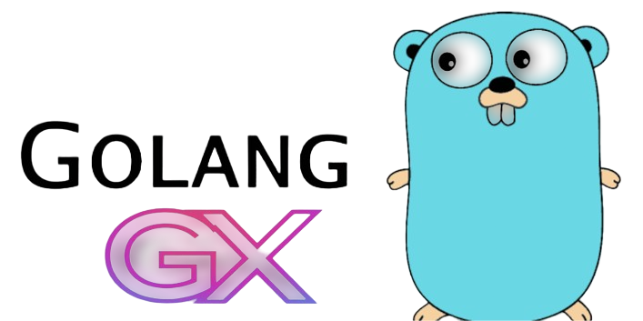
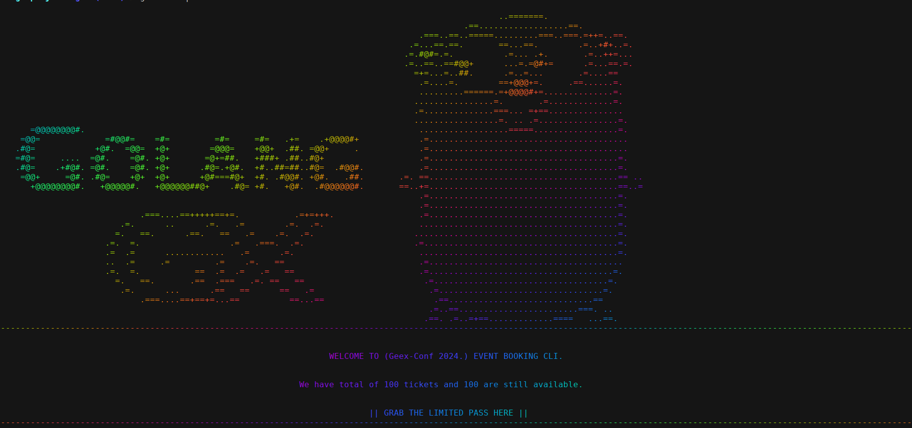
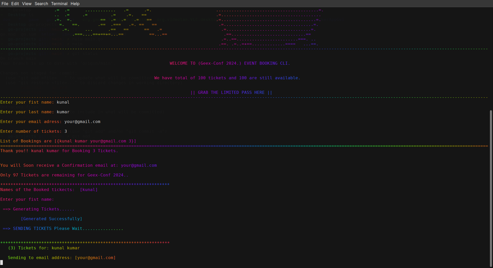

# Booking-App-CLI


The `Go CLI` (Command-Line Interface) Ticket Generator is a robust and efficient application designed to streamline the process of booking and managing event tickets. This tool provides an easy-to-use interface for users to input their details and receive their event tickets promptly via email.
 
 # Key Feature
 ### 1. User Input Collection:

 Name: Collects the full name of the user.
 - Email: Gathers the user's email address to send the ticket.
- Number of Tickets: Captures the quantity of tickets the user wants to purchase.
- Event Date: Records the date of the event for which the tickets are being booked.

### 2. Unique Ticket ID Generation: 
Each ticket is assigned a unique identifier to ensure proper tracking and validation.
- Ticket Creation: The application processes the inputs to generate a digital ticket containing all the necessary details, including the unique ticket ID.
### 3. Email Notification:
**Automated Email Sending:** Once the ticket is generated, the application automatically sends an email to the provided address. This email contains the ticket with all relevant details and the unique ticket ID

## Technical Overview:
-  __Programming Language:__ The application is built using Go, known for its simplicity, performance, and concurrency capabilities, making it ideal for handling input/output operations and email notifications efficiently.
-  **Input Handling:** Utilizes Go’s `flag` package to parse command-line arguments, ensuring a seamless user experience.
- **Unique ID Generation:** Implements a `UUID` generation library to create unique ticket identifiers.
- **Email Sending:** Integrates with an `SMTP` library to handle email delivery, ensuring the tickets reach the users promptly and reliably.

## Documentation

check out Go Documentation for GO:
[Documentation](https://go.dev/doc/)


## Setting up Locally

To clone this project run

```bash
git clone https://github.com/KunalKumar-1/go-projects 
```


## Run Locally

Go to the project directory

```bash
cd go-projects
```
## Initialise Go module(if needed)
In case if you need to create the go Module
```bash
go mod init
```
* **And change the file directry of main file to the directry of the main file in import "main.go file/helper"(if not changed leave it as it is)**


## Import dependencies
* Type the following commands in your terminal to import dependencies.

For setting up go env.
```bash
go get github.com/joho/godotenv
```
For setting up figlet4go.
```bash
go get github.com/mbndr/figlet4go
```
## make some changes here:
* open `.env` file and change the ``mail_pass`` ,enter the generated password of Your email.
* in`sendMIals()` function change the `YourMail@gmail.com` to your real UserId from which mails are goona be sent.  
* To cahnge the (event name) Change `conferenceName` to your desired name.

## Run the project
```bash
go run . | lolcat
```
## Optimization
* Batch Processing.
* Input Validation.
* Goroutines and Channels.
* Worker Pools.


"struct" which provides basic syncronization , WaitGroup,
used various Goroutines to wait for(increase the counter by the provided number).

## How it works ?
1. Run the CLI Application: The user launches the application from the command line.
1. Provide Necessary Details: The user inputs their name, email, number of tickets, and event date.
1. Process and Generate Ticket: The application processes these details, generates a unique ticket ID, and creates the ticket.
1. Send Email: The application sends the ticket to the user's email address.


## 

**Client:** Go , ntp/smtp, [godotenv](github.com/joho/godotenv) ,[figlet4go](github.com/mbndr/figlet4go) , linux 

## Screenshots
```start ```

```genereates```


## Contributing

Contributions are always welcome!

See `contributing.md` for ways to get started.

Please adhere to this project's `code of conduct`.


